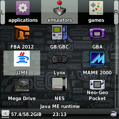
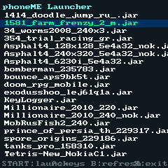
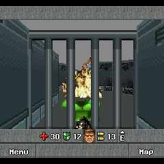
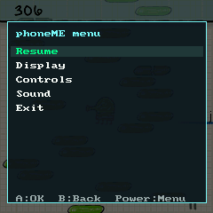

# phoneME FunKey J2ME Runtime

> If a specific game doesn't work, reach out on Telegram: [@slr_moon](https://t.me/slr_moon)

A `phoneME`-based Java ME runtime and `OPK` wrapper for `FunKey S / RG Nano`.

Based on the upstream phoneME-GP2X-SDL source at:  
<https://github.com/j2me-preservation/phoneME-GP2X-SDL>

## Screenshots

<p float="left">
  
  
  
  
</p>

## Installation

1. Download `pm.opk` from the [latest release](https://github.com/slrmoon/j2me-funkey-rgnano/releases/latest)
2. Place it in the `emulators` folder on your FunKey/RG Nano SD card
3. Create a `java` folder in the root of the SD card
4. Put your `.jar` files into that `java/` folder

## Scaling setup

Launch a game, press **Power** to open the overlay, then follow this order:

### 1. Set original resolution first

Pick the game's native screen size. If this is wrong, Fit/Fill/Stretch will produce distorted results.

| If the game looks... | Resolution is probably wrong |
|---|---|
| Stretched, cropped, too small, off-center, or UI is outside the screen | Try a different original resolution |

**Starting points for old J2ME games:**

| Orientation | Try these first |
|---|---|
| Portrait | 240×320 |
| Old Nokia / Sony Ericsson | 176×208 or 176×220 |
| Very old phones | 128×160 |
| Landscape | 320×240 |
| Square | 128×128 |

### 2. Then choose scaling mode

- **Fit** — game fits entirely, proportions kept. Safest mode if text, HUD, menus matter.
- **Fill** — fills more screen, edges may crop. Try when black bars are distracting.
- **Stretch** — forced 240×240, no proportions. Last resort only.
- **Original** — native size, no scaling. Best for 240×240 games.

---

## Repository structure

This export is split into two parts:

- `phoneme-funkey-clean`
  Cleaned runtime source tree with FunKey-specific build scripts.
- `phoneme-funkey-opk-wrapper`
  `OPK` packaging layer, launcher, icon, Nokia compatibility stubs, and JAR/JAD wrapper logic.

Intentionally not included:

- `FunKey-sdk-2.3.0`
- `Zulu JDK 7`
- `build_output*`
- `.toolchains`
- prebuilt `OPK` files
- local test JARs and older backup/dev folders

## Required dependency versions

1. FunKey SDK
   Version: `2.3.0`
   Official docs: <https://doc.funkey-project.com/developer_guide/tutorials/build_system/build_program_using_sdk/>
   Release download used by this project:
   `https://github.com/FunKey-Project/FunKey-OS/releases/download/FunKey-OS-2.3.0/FunKey-sdk-2.3.0.tar.gz`

2. JDK
   Version: `Azul Zulu JDK 7`
   Exact archive used by this project:
   `zulu7.24.0.1-ca-jdk7.0.191-linux_x64.tar.gz`
   Archive index:
   <https://cdn.azul.com/zulu/bin/zulu>
   Direct download:
   `https://cdn.azul.com/zulu/bin/zulu7.24.0.1-ca-jdk7.0.191-linux_x64.tar.gz`

## Host build requirements

Confirmed working on **Ubuntu 26** (amd64 host).

- `bash`
- `make`
- `gcc`
- `g++`
- `find`
- `sed`
- `grep`
- `file`
- `mksquashfs`
- `gcc-multilib`
- `g++-multilib`
- `libc6-dev-i386`

## Expected layout

```text
repo/
  phoneme-funkey-clean/
  phoneme-funkey-opk-wrapper/
```

Recommended approach: keep the SDK and JDK outside the repository and pass them explicitly via env vars.

If you prefer local unpacked copies, these are the paths the scripts know how to use by default:

- `phoneme-funkey-clean/FunKey-sdk-2.3.0`
- `phoneme-funkey-clean/zulu7.24.0.1-ca-jdk7.0.191-linux_x64`
- `phoneme-funkey-clean/zulu7.24.0.1-jdk7.0.191-linux_x64`

## Build runtime

```bash
cd phoneme-funkey-clean
JDK_DIR=/path/to/zulu7.24.0.1-ca-jdk7.0.191-linux_x64 \
FUNKEY_SDK_DIR=/path/to/FunKey-sdk-2.3.0 \
./build-funkey-s.sh
```

Main runtime outputs:

- `phoneme-funkey-clean/phoneME-GP2X-SDL/phoneme_feature/build_output_funkey_s/midp/bin/arm/runMidlet`
- `phoneme-funkey-clean/phoneME-GP2X-SDL/phoneme_feature/build_output_funkey_s/cldc/linux_arm_vfp/dist/bin/cldc_vm`

## Build OPK (launcher)

The wrapper builds a self-contained `pm.opk` with the full runtime, SDL launcher, desktop entry and icon.

**Launcher build** (no external JAR required):
If no MIDlet is passed, the script still builds the launcher `OPK`. In that mode it also bundles a tiny built-in `HelloMidlet` as a fallback/test MIDlet inside the package, but the main user-facing entry point is still the SDL launcher.

```bash
cd phoneme-funkey-opk-wrapper
FUNKEY_PHONEME_ROOT=../phoneme-funkey-clean/phoneME-GP2X-SDL \
JDK_DIR=/path/to/zulu7.24.0.1-ca-jdk7.0.191-linux_x64 \
FUNKEY_SDK_DIR=/path/to/FunKey-sdk-2.3.0 \
./package-funkey-opk.sh
```

**With your own bundled MIDlet:**

```bash
cd phoneme-funkey-opk-wrapper
FUNKEY_PHONEME_ROOT=../phoneme-funkey-clean/phoneME-GP2X-SDL \
JDK_DIR=/path/to/zulu7.24.0.1-ca-jdk7.0.191-linux_x64 \
FUNKEY_SDK_DIR=/path/to/FunKey-sdk-2.3.0 \
./package-funkey-opk.sh /path/to/game.jar
```

If the JAD is separate, pass it as second argument.  
Set `FUNKEY_MIDLET_MAIN` to specify the main class explicitly.

Result: `phoneme-funkey-clean/phoneME-GP2X-SDL/phoneme_feature/build_output_funkey_s/opk/pm.opk`

## Known issues

- **Controls** — button mapping is still incomplete on FunKey S / RG Nano; some games may require tweaking `PHONEME_KEY_PROFILE` and `PHONEME_ENABLE_GP2X_KEYS` env vars inside `r.sh`.
- **No 3D** — JSR 184 (M3G) is not supported. 3D J2ME games will not run.

## Debugging

After launching a game, the runtime writes a log to:

`/mnt/FunKey/.pm/runmidlet.log`
